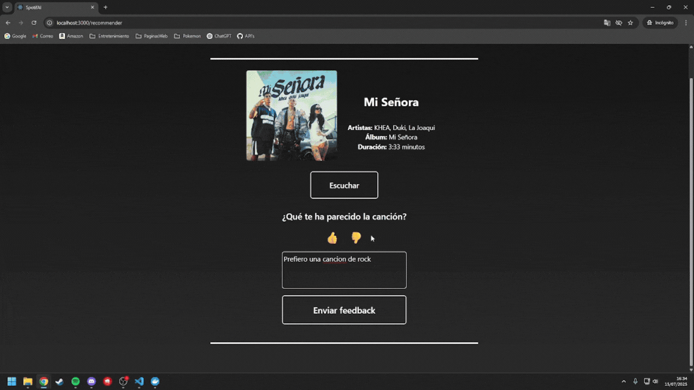
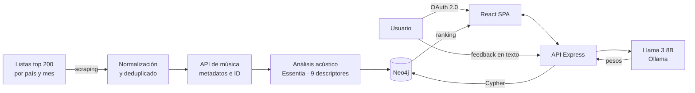

# TempoGraph

Motor de recomendación musical que combina análisis acústico de señal, un grafo de conocimiento en Neo4j y un LLM local para ajustar las recomendaciones escribiendo en lenguaje natural.

`Python` · `Essentia` · `Neo4j` · `Llama 3 8B (Ollama)` · `React` · `Express` · `Docker`



## Qué problema resuelve

Los recomendadores comerciales funcionan como cajas negras: sugieren, pero el usuario no puede intervenir en criterios subjetivos o contextuales — *"quiero algo más relajado"*, *"no me gusta que tenga tanto ritmo"*, *"algo parecido pero de otro artista"*.

TempoGraph ataca ese problema desde tres frentes:

1. **Ajuste conversacional.** El usuario modifica el algoritmo escribiendo, sin tocar ningún control ni entender ningún parámetro técnico.
2. **Afinidad por contenido acústico real.** La similitud se calcula sobre métricas extraídas de la señal de audio, no sobre etiquetas de género asignadas a mano.
3. **Modelado en grafo con relaciones ponderadas.** Escuchar una canción, seguir a un artista o rechazar una recomendación pesan distinto en el ranking.

## Métricas del sistema

| | |
|---|---|
| Consulta de recomendación (Cypher) | < 1 s |
| Ajuste por lenguaje natural (Llama 3 8B local) | 2–5 s según la complejidad del texto |
| Análisis de una pista nueva | ~15 s |
| Descriptores acústicos por pista | 9, más género y popularidad vía API |
| Tipos de nodo | 3 — Usuario, Canción, Artista |
| Tipos de relación | 5, con peso diferenciado en el ranking |
| Cobertura de ingesta | Top 200 por país y mes, sobre 20 países |
| Validación | Pruebas funcionales, de rendimiento y de usabilidad con 5 usuarios |

Medido sobre un despliegue local de un solo nodo, no en un entorno productivo.

## Arquitectura



**Ingesta (Python).** Un script recorre las listas de las 200 canciones más escuchadas por país y por mes, descarga el HTML y lo procesa. El resultado se normaliza para eliminar duplicados —inevitables al cruzar países y fechas— y limpiar caracteres que la base de datos no acepta. Después cada canción se resuelve contra la API de música para obtener su identificador, sus géneros y su popularidad.

**Análisis acústico (Essentia).** De cada pista se extraen nueve descriptores: BPM, tasa de cambio de acordes, danceability, disonancia, loudness, pitch salience, centroide espectral, complejidad espectral y entropía tonal.

**Capa de lenguaje natural (Ollama + Llama 3 8B).** Traduce el mensaje del usuario a un ajuste de los pesos de preferencia. **No genera recomendaciones**: solo mueve parámetros.

**Grafo y motor de recomendación (Neo4j).** Tres tipos de nodo —Usuario, Canción, Artista— y cinco relaciones con peso distinto:

| Relación | Conecta | Peso |
|---|---|---|
| `LIKED` | Usuario → canción muy escuchada (último mes, 6 meses, año) | Alto — evidencia directa |
| `LIKED_ARTISTS` | Usuario → canciones de sus artistas más escuchados | Medio — evidencia indirecta |
| `LIKED_RECOMENDATION` | Usuario → recomendación marcada como buena | Alto y explícito |
| `DISLIKED_RECOMENDATION` | Usuario → recomendación rechazada | Negativo |
| `INTERPRETADA_POR` | Canción → artista | Estructural |

**Aplicación web (React + Express).** SPA en React; backend en Express que gestiona OAuth 2.0 y orquesta grafo, LLM y análisis. Incluye panel de administración para gestionar canciones, artistas y usuarios sin tocar la base de datos.

## Decisiones técnicas

**Neo4j en lugar de una base relacional.** Las consultas de recomendación son travesías de varios saltos: usuario → artistas escuchados → canciones de esos artistas → canciones con acústica próxima. En SQL eso son JOINs anidados cuyo coste se degrada al añadir profundidad; en Cypher es una travesía natural, y además permite ponderar por tipo de relación sin rehacer el esquema.

**El LLM traduce, no recomienda.** Es la decisión central del diseño. El modelo convierte texto libre en un ajuste de pesos y el ranking lo calcula Cypher de forma determinista. Así las recomendaciones son reproducibles y explicables, y el modelo no puede sugerir canciones que no están en el catálogo.

**Llama 3 8B en local en lugar de una API externa.** Coste nulo por petición, sin límites de tasa y sin que los datos de escucha del usuario salgan de la máquina. El precio son los 2–5 s de latencia frente al segundo escaso de una API comercial.

**Essentia en lugar de librosa.** Implementada en C++, más rápida y precisa en el procesado por lotes, y con descriptores de alto nivel listos para usar que en librosa habría que construir a mano.

**Scraping como fuente de arranque.** El catálogo inicial no podía salir de la API por sus límites de peticiones. El scraping de listas públicas no tiene ese techo: solo cuesta tiempo, y resuelve el arranque en frío del propio sistema antes de tener usuarios.

**Todo dockerizado.** Grafo, LLM, API y frontend se levantan con un solo `docker-compose up`, sin instalar Essentia ni Ollama a mano.

## Limitaciones conocidas

- **Arranque en frío del usuario.** Un usuario nuevo recibe recomendaciones pobres hasta que se procesan sus canciones y el grafo acumula sus relaciones.
- **Primer inicio de sesión lento.** Analizar las canciones que aún no están en la base tarda ~15 s por pista. Se avisa en el frontend y el sistema sigue recomendando mientras tanto, con menos precisión.
- **Contexto limitado del LLM.** El modelo interpreta el mensaje actual pero no mantiene memoria de las interacciones anteriores.
- **No analiza la letra.** Toda la afinidad es acústica y relacional; el contenido lírico queda fuera.
- **Sin señal contextual.** El grafo no modela hora del día, actividad ni estado de ánimo, que son de las señales más fuertes en recomendación musical.
- **Volumen del catálogo.** Contiene una selección representativa, suficiente para validar el sistema pero no para un entorno realista.

## Líneas de trabajo futuras

- Entrada por voz y reconocimiento del estado de ánimo a partir del habla.
- Modelos con mayor ventana de contexto para mantener el historial conversacional.
- Cuantización o carga parcial del modelo para bajar la latencia del ajuste.
- Relaciones entre usuarios para recomendaciones de grupo: un viaje, una fiesta, una sesión compartida.

## Despliegue local

Requiere Docker, Docker Compose y credenciales propias de la API de música.

```bash
git clone {URL}
cd tempograph

# Configurar credenciales
cp app-web/.env.example app-web/.env
#   CLIENT_ID, CLIENT_SECRET, REDIRECT_URI, NEO4J_USER, NEO4J_PASS

# Levantar el stack completo
cd dockerization
docker-compose up -d
```

La aplicación queda en `http://localhost:3000`.

> La primera ejecución descarga el modelo Llama 3 8B (varios GB). Si solo quieres ver el sistema funcionando, el GIF de arriba lo muestra completo.

## Contexto

Desarrollado como Trabajo de Fin de Grado en Ingeniería Informática, Universidad de León (julio de 2025). Calificación: 9,8.
